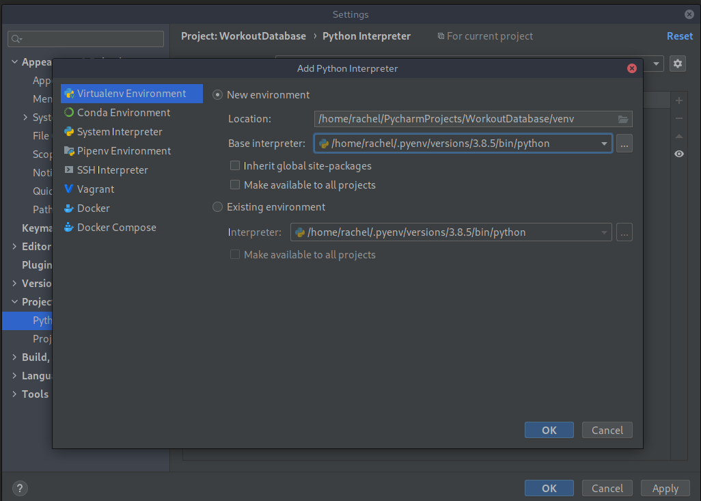

#### Install pyenv

```bash
[rachel@rachelDesktop ~]$ pyenv install 3.8.5
Downloading Python-3.8.5.tar.xz...
-> https://www.python.org/ftp/python/3.8.5/Python-3.8.5.tar.xz
Installing Python-3.8.5...
Installed Python-3.8.5 to /home/rachel/.pyenv/versions/3.8.5
```


#### add to pyenv to pycharm



#### Full run project gif


#### Selecting previous workout from username


#### Full run Debug and database preview gif


#### Full run Debug and database preview gif


#### Choose new or old workout


#### Name your new workout


#### Select muscle group


#### Select exercises from listed choices


#### Return exercises selected


#### append to the database

#### execute database table insert


