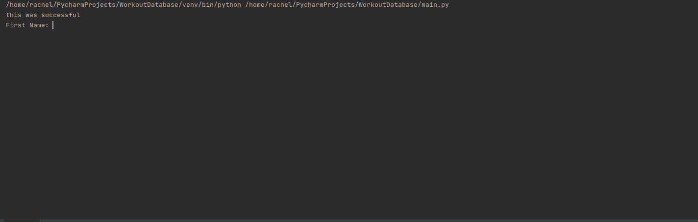
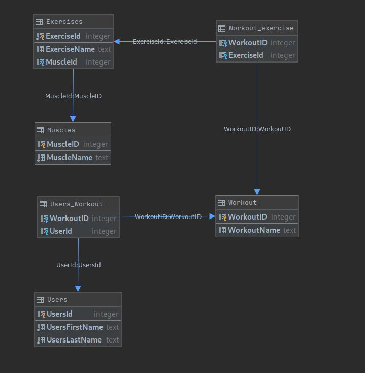

#Workout Database

This app helps a user create new workouts based off of user selected muscle groups,
returns exercise associated with that muscle group, and stores them for later use.

#### Run Application

To run application start the `main.py`. Enter your first and last name, create new workout, 
select muscle group, and then choose your exercises.
This will store your workout into a sqlite database.

To retrieve your existing workouts you will rerun `main.py`. Then you will enter your first name
and select from the existing workout options. This will show your previous workouts. Select the workout that
your interested in and it will list all exercises that are associated with that workout. 

#### Database Schema

This is my normalized schema of my database. My database is SQlite

#### Debug my project in pycharm

